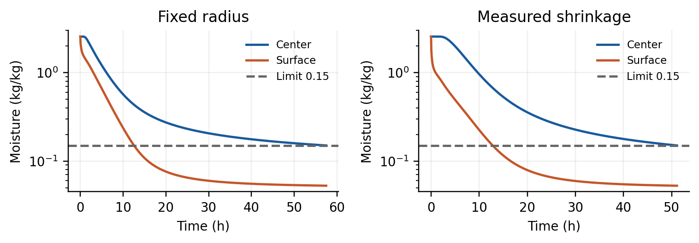

# Herbal Drying — CUMCM 2026 Problem A

[](https://github.com/HollisPeng/cumcm-2026-a-herbal-drying/actions/workflows/ci.yml)
[](LICENSE)

[English](README.md) | [简体中文](README.zh-CN.md)

A personal study of heat and moisture transport in cylindrical medicinal herbs, based on **Problem A of the 2026 China Undergraduate Mathematical Contest in Modeling (CUMCM)**. This repository brings together the completed paper, source code, supplied data, numerical results, and figures.

**The author completed this study out of personal interest, did not participate in the 2026 competition, and this project is not an official competition submission.** The project was completed with assistance from **GPT-5.6 Sol** and **GPT-6 Astra**.

## Start here

- Read the [paper (Chinese, PDF)](paper/herbal-drying.pdf); the [Word source](paper/herbal-drying.docx) is retained for editing.
- Consult the [original problem statement (Chinese)](problem/problem-A.pdf).
- Browse the [result workbooks](results/workbooks), [numerical summary](results/summary.json), and [figures](figures).
- See [material provenance and preservation notes](docs/materials.md) for the relationship to the supplied files and the paper's historical appendix paths.

## Background and approach

The problem considers a cylinder initially 25 cm long and 2 cm in radius, with uniform temperature 28 °C and dry-basis moisture content 2.55 kg/kg. The four questions cover preheating, variable-property drying, the drying endpoint at fixed radius, and drying with measured shrinkage.

The existing solution uses an axisymmetric radial heat and moisture transport model, surface-refined finite volumes, an integrated moisture diffusion potential, and SciPy's implicit BDF time integrator. Questions 2 and 3 share one continuous variable-property trajectory from the initial state. Question 4 uses a moving material coordinate and measured radius, together with its specified material-property formulas.

## Recorded results

The values below come from the retained paper and [summary.json](results/summary.json), without recalculating the model during repository preparation.

| Case | Recorded outcome |
| --- | --- |
| Q1: 1,800 s preheating | Center / surface temperature: **33.5753 / 36.7856 °C**; moisture: **2.5500 / 1.5102 kg/kg** |
| Q2: first 3 h | Center / surface temperature: **49.8495 / 49.9664 °C**; moisture: **1.7662 / 1.0081 kg/kg** |
| Q3: fixed radius | Threshold crossing: **57.4723 h**; first strictly compliant integer second: **206,901 s (57.4725 h)** |
| Q4: measured shrinkage | Threshold crossing: **51.0906 h**; first strictly compliant integer second: **183,927 s (51.0908 h)** |



The endpoint is determined from the **unrounded spatial maximum** of moisture content. The crossing corresponds to 0.15 kg/kg; the saved final row is the first integer second strictly below that threshold. A displayed value of `0.1500` can therefore satisfy the stopping condition. Questions 3 and 4 change both material properties and geometry, so their time difference cannot be attributed entirely to shrinkage.

The existing records include grid comparisons at N = 400, 800, and 1,600, sensitivity analyses, moisture-balance checks, and a constant-property analytical heat-conduction comparison. These are numerical consistency checks, not experimental validation against internal herb measurements.

## Repository structure

```text
.
├── README.md                 English overview
├── README.zh-CN.md           Chinese overview
├── LICENSE                   MIT License for original project content
├── requirements.txt          Python dependencies
├── problem/
│   ├── problem-A.pdf         Original complete problem statement
│   ├── attachments/          Original attachment 1 and 2 workbooks
│   └── templates/            Original four result templates
├── paper/
│   ├── herbal-drying.pdf     Completed paper for reading
│   └── herbal-drying.docx    Editable paper source
├── code/
│   ├── solve.py              Existing numerical model and analyses
│   ├── plot_results.py       Rebuild the five paper figures
│   ├── verify.py             Saved-file checks and analytical comparison
│   └── export_results.mjs    Optional workbook formatting/export
├── data/                     CSV transcriptions used by the model
├── results/
│   ├── workbooks/            Completed result1.xlsx–result4.xlsx
│   ├── result*_T.csv         Temperature outputs
│   ├── result*_C.csv         Moisture outputs
│   ├── radius_output.csv     Q4 surface radius by output time
│   ├── summary.json          Recorded results and numerical analyses
│   └── verification.json     Original verification record
├── figures/                  Five existing paper figures
└── docs/
    └── materials.md          Provenance and preservation notes
```

## Data and output conventions

`data/air.csv` transcribes attachment 1: 241 samples at 60 s intervals over 0–14,400 s. `data/radius.csv` transcribes attachment 2: 145 samples at 1,800 s intervals over 0–72 h. The original XLSX files remain in `problem/attachments/` for reference.

| Workbook | Content and sampling |
| --- | --- |
| [result1.xlsx](results/workbooks/result1.xlsx) | Temperature and moisture sheets; 1–1,800 s at 1 s intervals; radius 0–2 cm at 0.1 cm intervals |
| [result2.xlsx](results/workbooks/result2.xlsx) | Temperature and moisture sheets; 1–10,800 s at 1 s intervals; the same radial coordinates |
| [result3.xlsx](results/workbooks/result3.xlsx) | Moisture every 60 s from 60 s, plus the endpoint; 3,449 rows; radius 0–2 cm |
| [result4.xlsx](results/workbooks/result4.xlsx) | Moisture every 60 s from 60 s, plus the endpoint; 3,066 rows; fixed radii 0–1.9 cm plus the moving surface; a second sheet records surface radius |

Time is in seconds, CSV radial headers are in centimeters, temperature is in °C, and moisture is in kg/kg on a dry basis. The model uses meters internally and converts temperature to kelvin for the Arrhenius law. Initial conditions are in the code; output tables begin at the first positive sampling time.

Workbooks contain static numeric values rounded to four decimal places. The corresponding CSV files retain approximately ten significant digits before that rounding. Blank Q4 cells, CSV `nan`, and JSON `null` denote physical coordinates outside the shrunken herb; **they do not mean zero**. The fixed 2 cm column is omitted in Q4 because it is outside the domain at every saved time; the final column always represents the actual surface.

## Usage

### Read and check the saved results

Reading the paper, figures, and workbooks requires no computation. For Python tools, use Python 3.12 and install dependencies from the repository root:

```bash
python -m venv .venv
# Activate: Windows PowerShell: .venv\Scripts\Activate.ps1
# Activate: macOS/Linux: source .venv/bin/activate
python -m pip install -r requirements.txt
python code/verify.py --files-only
```

`--files-only` checks all six temperature/moisture tables and the Q4 radius sheet against the saved CSVs, including dimensions, timestamps, blank positions, and rounding tolerance. It performs no numerical solve and does not overwrite the recorded verification file.

GitHub Actions runs this saved-file check on Ubuntu with Python 3.12 for pushes and pull requests; it can also be started manually from the Actions tab. CI checks dependency consistency and verifies that tracked files remain unchanged. It does not rerun the numerical model or export workbooks.

### Reproduce the existing computation (optional)

The following commands are provided for readers who choose to regenerate the existing results. **They overwrite numerical results and figures**, so run them in a separate copy if you need to preserve the published files.

```bash
python code/solve.py --n 800 --validation
python code/plot_results.py
python code/verify.py
```

The original materials report Python 3.12 / SciPy 1.17.0, N = 800, relative tolerance `2e-8`, and absolute tolerance `2e-10`. `requirements.txt` retains the original compatible minimum versions; it is not a fully pinned environment. Small numerical differences can occur with different dependency versions.

The solver uses no random numbers and needs no network access after dependencies are installed. It generates three `results/*_profiles.npz` files required by the plotting script. These regenerable intermediates are excluded from Git; the five finished figures are included. Running the plotting script alone in a fresh checkout will require those NPZ files first. Omitting `--validation` regenerates the main cases but removes the convergence and sensitivity sections from the newly written summary. Default `verify.py` also runs the analytical heat test and overwrites `results/verification.json`; XLSX files remain unchanged.

### Optional workbook export

The existing `export_results.mjs` formats already computed CSV values. It requires a Node.js environment able to resolve `@oai/artifact-tool` version 2.8.58 or later, as described in the original materials; this is an optional Codex-specific dependency, separate from the Python requirements.

```bash
node code/export_results.mjs 1
node code/export_results.mjs 2
node code/export_results.mjs 3
node code/export_results.mjs 4
```

Exports overwrite `results/workbooks/result*.xlsx` and create ignored previews in `previews/`. Without this dependency, the saved workbooks remain readable and all Python computations and CSV checks are available.

## Assumptions and limitations

Ambient conditions are linearly interpolated over the observed first four hours and then held at **50 °C and 0.05 kg/kg**. This continuation is an assumption, not an observation. Radius measurements are also linearly interpolated; the recorded Q4 endpoint lies within the observed 72 h interval.

The model assumes radial symmetry, an effective moisture boundary condition, and uniform skeleton shrinkage. It neglects axial transport, radiation, and latent-heat coupling. Empirical density affects heat capacity only. Interpret the results within these assumptions; the supplied data do not contain independent internal temperature or moisture measurements for experimental validation.

## Attribution and reuse

Except for the third-party materials under `problem/`, the original content of this repository is licensed under the [MIT License](LICENSE).

The problem statement, input attachments, and output templates originate from the supplied 2026 CUMCM Problem A materials. They remain subject to the rights of their respective owners and are not relicensed under MIT. Their inclusion does not imply contest-organizer affiliation or endorsement. See [material notes](docs/materials.md).
